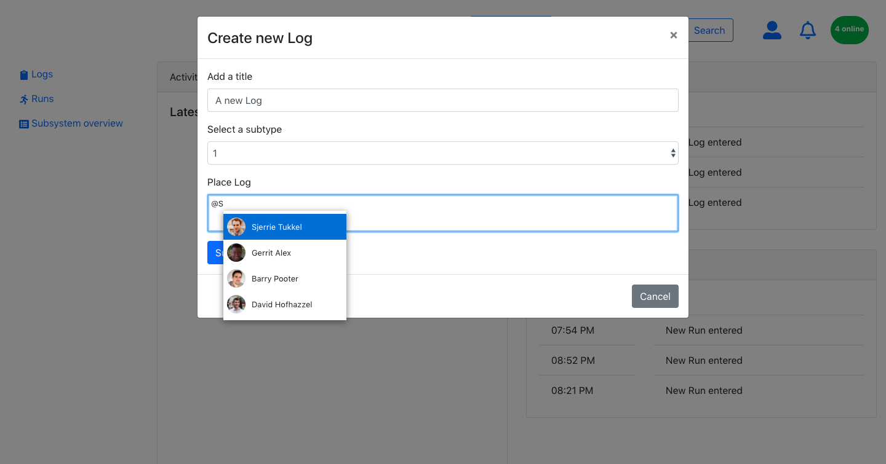
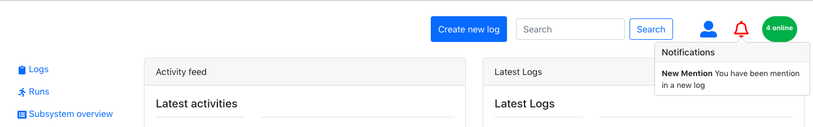

# Project 3 - Cern logbook system

De opdracht was om een binnen 3 dagen een aantal kleine iteraties te maken op een al bestaand UI. Het bestaande UI is van een applicatie genaamd 'Jiskefet'. Jiskefet wordt bij CERN gebruikt om runs en logs te documenteren. De runs en logs bestaan uit data verzameld door een detector in de deeltjesversneller bij CERN.

Ik ben te werk gegaan als een mix van een UX'er en een developer. Niet echt als een UI designer. Deze keuze heb ik genomen omdat ik te weinig informatie had over de specifieke content die in de applicatie moest worden toegepast. Zo hadden we alleen sample data, was de rolverdeling op de werkvloer bij CERN nog niet duidelijk en stond de applicatie wat betreft UX nog in zijn kinderschoenen. 
De keuzes in UX die ik heb gemaakt, heb ik daarna bij wijze van Prototyping gebouwd in React. 

## het 'oude' ui

Een aantal dingen vielen mij op:

- bij binnenkomst van de applicatie wordt de gebruiker direct confronteerd met een hoop data.

- De filterafdeling neemt veel visuele hierarchie in op de eerste pagina.

- Vanuit de opdrachtgever was er de vraaag om te kijken naar een soort notificatie systeem. De mensen die de logs en runs invoeren werken namelijk in Teams. 

- De hoofdfunctie van deze applicatie verdrinkt als het ware in de vormgeving. Het doel van de applicatie is namelijk het monitoren en loggen van data. 

- er werken mensen van veel verschillende nationaliteiten in het team. Zij ervaren vaak hinder aan de grote taalbarrieres. 

  

  ## Het 'nieuwe' UI

  

  

Wat ik heb gedaan: 

- Ik heb iconografie toegepast om het voor mensen van verschillende nationaliteiten begrijpelijker te maken, wat er nou precies gebeurd in de applicatie. Zo heb ik iconen geplaats in de linker navigatie balk en rechtsboven in de topnav. 
- Functies van de applicatie van elkaar gescheiden. Links waarmee je door de applicatie kan navigeren heb ik links geplaatst. Directe interacties heb ik rechtsboven geplaatst. 
- De "create new log" knop heb ik verplaatst naar een topnavigatie. Hier krijgt een van de belangrijkste acties van de applicatie een betere visuele hierarchie. Deze knop opent een modal. In dat modal kun je de log schrijven. Hier heb ik voor gekozen omdat gebruikers met een modal altijd nog context houden van waar ze zich op dat moment bevinden in de applicatie. 

- Bij het invoeren van een nieuwe log heb ik 'progressive disclosure' toegepast om fouten tijdens het invoeren van het log te voorkomen. Je moet als gebruiker minimaal een titel hebben ingevuld voordat je op submit kan drukken.  

- Vanuit de opdrachtgever was er de vraag of er gekeken kon worden naar een notifications systeem. Naar mijn idee werd het overkill wanneer alle gebruikers van alle acties een notificatie moesten ontvange. Ik heb dit dus uit elkaar getrokken. Aan de ene kant heb je 'activities'. Dit is een live update lijst van alle gebeurtenissen die hebben plaatsgevonden in een vooraf afgesproken tijd. Te vergelijken met een live social media feed. Aan de andere kant heb je notificaties die een gebruiker alleen ontvangt wanneer er een directe noodzaak is voor een actie. Een gebruiker kan een notificatie ontvangen wanneer een andere gebruiker zijn/haar naam Mentioned in een log. 

  

  

-  voor dit prototype heb ik een mention systeem gebouwd. In de onderstaande foto zie je de interactie die plaats vindt wanneer een gebruiker een mention ontvangt. Het recent ingevoerde log wordt toegevoegd aan de 'Latest activities' lijst.

  

## Tech

Voor het bouwen van deze prototype heb ik React gebruikt.  React kwam het dichts in de buurt van de stack die de developers van Jiskefet al gebruikte. Tevens was het voor mij gemakkelijk omdat je met create-react-app vrij snel een minimum hebt staan waarmee je aan de slag kan. 

### De scripts

In je project folder start je de app in development mode met:

### `npm start`

Vervolgens ga je naar http://localhost:3000 in je browser. Create-react-app bevat wat linters en heeft een hot reload in de browser. Webpack wordt gebruik als bundler.

### `npm test`

Start de test runner in interactive watch mode 

### `npm run build`

Bouwt de app voor productie in een Build folder. De build wordt geminified en filenames zullen hashes bevatten.

### Documentation

[Create React App documentation](https://facebook.github.io/create-react-app/docs/getting-started).